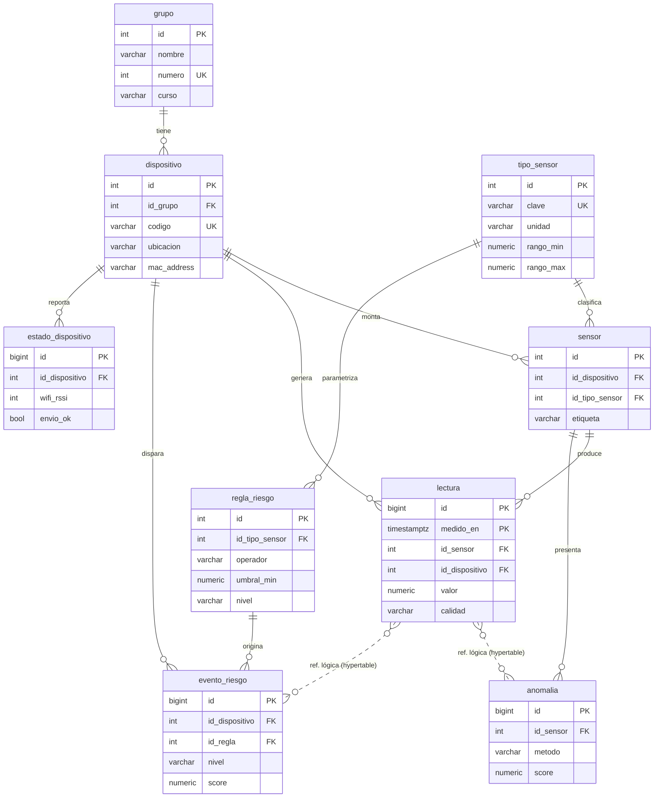

# Modelo de datos — 9 tablas relacionadas

Schema `combustion_riesgo` en PostgreSQL 17 + TimescaleDB 2.26.
Requisito del profesor: **mínimo 7 tablas relacionadas**. Aquí hay **9**, todas
unidas por clave foránea, más 2 vistas y 1 agregado continuo.

## Diagrama entidad–relación

## Diccionario de tablas

| # | Tabla | Tipo | PK | FKs | Notas |
|---|---|---|---|---|---|
| 1 | `grupo` | maestra | `id` int | — | identificación del grupo (`numero` único) |
| 2 | `dispositivo` | maestra | `id` int | `id_grupo` | el ESP32; `codigo` único = "identificación del dispositivo" |
| 3 | `tipo_sensor` | catálogo | `id` int | — | `MQ7`, `HUM_SUELO`; `rango_min/max` → validación de rango |
| 4 | `sensor` | maestra | `id` int | `id_dispositivo`, `id_tipo_sensor` | UNIQUE(dispositivo,tipo) |
| 5 | `lectura` | **hypertable** | `(id, medido_en)` | `id_sensor`, `id_dispositivo` | log append-only; particionada por día |
| 6 | `regla_riesgo` | catálogo | `id` int | `id_tipo_sensor` (nullable) | motor de reglas; `nombre` único |
| 7 | `evento_riesgo` | hechos | `id` bigint | `id_dispositivo`, `id_regla` | alertas de combustión; `score` 0–100 |
| 8 | `anomalia` | hechos | `id` bigint | `id_sensor` | atípicos (`zscore`/`iqr`/`rango_fisico`) |
| 9 | `estado_dispositivo` | log | `id` bigint | `id_dispositivo` | heartbeat: RSSI, memoria, `envio_ok`, texto LCD |

### Nota sobre TimescaleDB y las claves foráneas

TimescaleDB **permite** FKs que salen de una hypertable hacia tablas normales
(`lectura → sensor`, `lectura → dispositivo`) pero **no permite** FKs que
apuntan *hacia* una hypertable. Por eso `anomalia` y `evento_riesgo` referencian
la lectura de forma **lógica** (`id_lectura` + `lectura_medido_en`, sin
constraint física). Es una limitación conocida del motor, no del diseño.

## Objetos analíticos

| Objeto | Tipo | Para |
|---|---|---|
| `ca_lecturas_15min` | agregado continuo (TimescaleDB) | avg/min/max por sensor cada 15 min, con política de refresco |
| `vw_lecturas_enriquecidas` | vista | una fila por lectura + sensor + tipo + dispositivo + grupo (Streamlit / Power BI) |
| `vw_riesgo_por_hora` | vista | CO y humedad por hora y dispositivo + conteo de anomalías y eventos (dashboard) |

Además se aplica **compresión** de chunks de más de 14 días
(`add_compression_policy`).

## Reglas de riesgo sembradas (`regla_riesgo`)

| nombre | variable | condición | nivel | puntaje |
|---|---|---|---|---|
| CO moderado | MQ7 | ≥ 25 ppm | medio | 15 |
| CO alto | MQ7 | ≥ 50 ppm | alto | 25 |
| CO crítico | MQ7 | ≥ 100 ppm | crítico | 40 |
| Suelo seco | HUM_SUELO | ≤ 20 % | medio | 15 |
| Suelo muy seco | HUM_SUELO | ≤ 12 % | alto | 25 |
